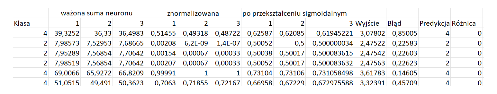
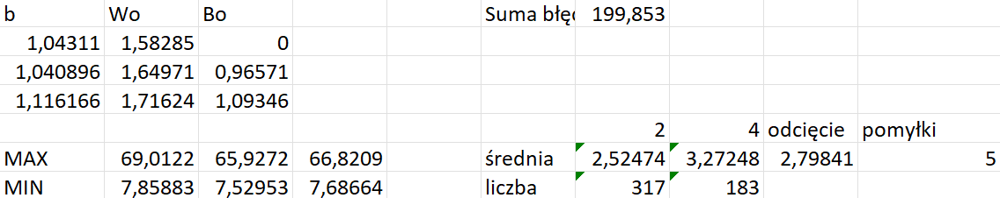
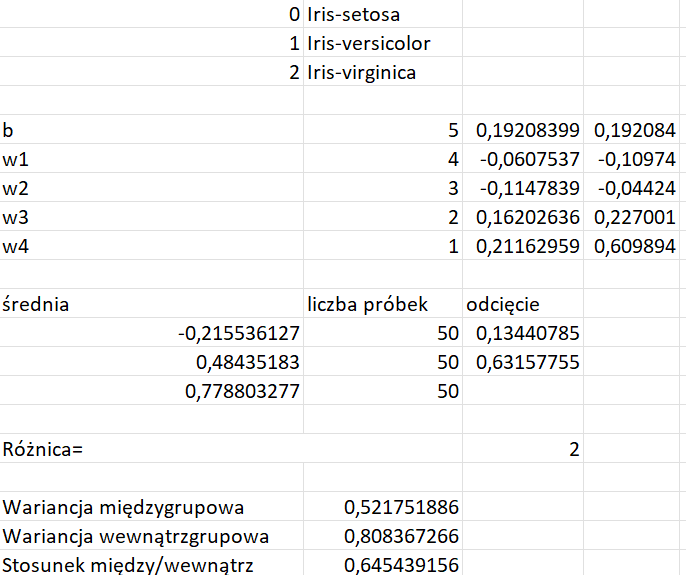
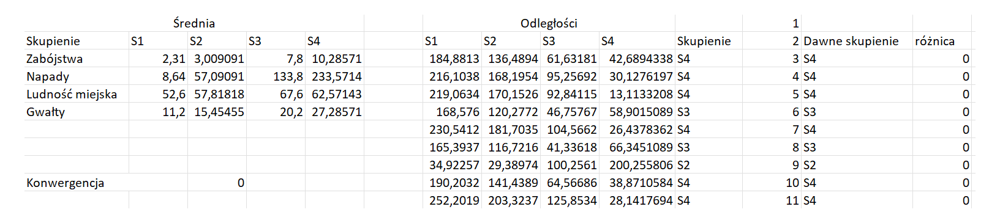
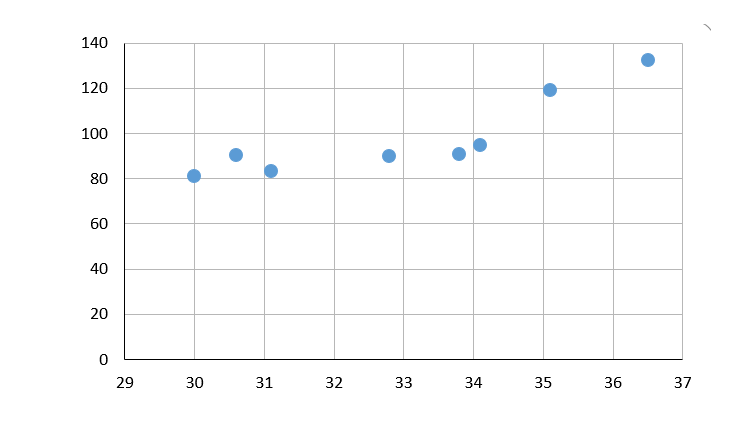
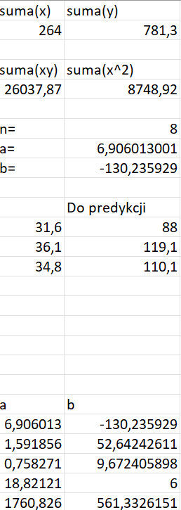

# ML w Excelu, bez bibliotek

Pięć algorytmów policzonych formułami w arkuszu. Bez Pythona, bez sklearn, bez `model.fit()`. Każdy krok - propagacja przez warstwy, normalizacja, odległości, dopasowanie prostej - siedzi w komórce i da się go prześledzić.

Robiłem to na studiach. Wrzucam, bo w arkuszu nie da się schować za wywołaniem funkcji.

[English below](#ml-in-excel-no-libraries)

| # | Projekt | Dane | Wynik |
|---|---|---|---|
| [01](01-siec-1-warstwa) | Sieć, 1 warstwa ukryta | 683 rekordy, 9 cech, 2 klasy | 5 pomyłek na 183 testowych (97,3%) |
| [02](02-lda-iris) | LDA | Iris, 150 rekordów | 2 pomyłki na 150 |
| [03](03-k-srednich) | k-średnich | 50 obiektów, 4 cechy | zbieżność w 5 iteracji |
| [04](04-siec-2-warstwy) | Sieć, 2 warstwy ukryte | 172 rekordy, 3 klasy | 48 pomyłek na 172 |
| [05](05-regresja-liniowa) | Regresja liniowa | 8 punktów | R² = 0,758 |

Tylko w projekcie 01 wydzieliłem zbiór testowy. Reszta liczy skuteczność na tych samych danych, na których dobierałem parametry, więc te wyniki są zawyżone. Zostawiam je tak, jak powstały - dziś rozdzieliłbym dane wszędzie.

## 01. Sieć z jedną warstwą ukrytą

683 rekordy, 9 cech w skali 1-10, dwie klasy. Dane wyglądają na Breast Cancer Wisconsin z UCI.

9 wejść, 3 neurony ukryte, sigmoida, wyjście przez `MMULT`. Próg decyzyjny to średnia ważona średnich wyjścia w obu klasach. Wagi dobierał Solver.

Uczyłem na wierszach 11-510, a 511-693 zostawiłem na test i podczas dopasowania ich nie ruszałem. Na tych 183 wierszach wyszło 5 pomyłek.

Cała ścieżka dla kilku rekordów: suma ważona, normalizacja, sigmoida, wyjście, błąd, predykcja, trafienie.

Suma błędów 199,853 dotyczy zbioru uczącego, pomyłki 5 - testowego.

Uwaga na `317` i `183` w wierszu „liczba": to liczebność obu klas wewnątrz zbioru uczącego (razem 500), a nie podział uczący/testowy. To, że zbiór testowy też ma 183 wiersze, jest przypadkiem.

## 02. LDA na irysach

Rzutuję cztery cechy na jedną oś tak, żeby gatunki rozjechały się jak najbardziej, i tnę dwoma progami. Progi to średnie ważone środków sąsiednich klas.

2 pomyłki na 150. Stosunek wariancji między/wewnątrz wyszedł 0,645 - obie wariancje liczę osobno, więc widać, skąd ta liczba.

Liczone na tych samych danych, na których dobierałem wagi.

## 03. k-średnich

50 obiektów, 4 cechy dotyczące przestępczości i urbanizacji, wygląda na USArrests. Etykiety zamieniłem na `L1`-`L50`. k = 4.

Każda iteracja to osobna zakładka, `k1` do `k6`. Odległości przez `SQRT`, przypisanie przez `INDEX`+`MATCH`+`MIN`, nowe centroidy przez `AVERAGEIFS`.

Kolumna „różnica" liczy, ile obiektów zmieniło skupienie względem poprzedniej iteracji: 4, 4, 2, 0, 0. Piąta iteracja to koniec, szósta tylko to potwierdza.

Po lewej centroidy, po prawej odległości i przypisania. `Konwergencja = 0` znaczy, że nikt już nie zmienił skupienia.

## 04. Sieć z dwiema warstwami ukrytymi

172 rekordy, 4 zmienne, 3 klasy oznaczone 39, 69 i 84. Nie odtworzyłem, skąd są te dane. Zakresy: x1 od 26,3 do 60,4, x2 od -9,3 do -3,3, x3 od -4,7 do -0,4, x4 od 3 do 9.

4 wejścia, dwie warstwy po 3 neurony, sigmoida po obu. Sieć uczona jak regresja na wartościach klas, wynik progowany na trzy przedziały.

48 pomyłek na 172, bez zbioru testowego.

Najbardziej rozbudowany arkusz z całej piątki i najsłabszy wynik. Z projektem 01 nie ma co porównywać, bo to inne dane i inne zadanie. Zostawiam, bo ciekawsza jest tu sama konstrukcja niż skuteczność.

## 05. Regresja liniowa

Osiem obserwacji, jedna zmienna. Współczynniki wyprowadzone z równań normalnych i policzone z sum, bez gotowej funkcji regresji. Wyszło `y = 6,906x - 130,236`.

Obok wrzuciłem `LINEST` dla porównania: błędy standardowe 1,592 i 52,642, R² = 0,758, F = 18,82 przy 6 stopniach swobody, suma kwadratów 1760,8 wyjaśniona i 561,3 resztowa.

Osiem punktów to za mało, żeby brać te przedziały na poważnie. Chodziło o wyprowadzenie i odczyt diagnostyki.

## Dane i uwagi

Dane wejściowe wyeksportowałem do CSV w [`dane/`](dane), żeby dało się je obejrzeć bez Excela. Wszystko to publiczne zbiory wzorcowe albo dane poglądowe, nic osobowego ani firmowego.

Arkusze zapisane razem z wynikami, więc widać je od razu po otwarciu. Wagi obu sieci dobierał Solver i jego ustawienia siedzą w plikach 01 i 04.

---

# ML in Excel, no libraries

Five algorithms worked out with spreadsheet formulas. No Python, no sklearn, no `model.fit()`. Every step - forward pass, scaling, distances, line fitting - lives in a cell you can trace.

University projects. I am putting them up because a spreadsheet leaves nowhere to hide behind a function call.

| # | Project | Data | Result |
|---|---|---|---|
| [01](01-siec-1-warstwa) | Network, 1 hidden layer | 683 records, 9 features, 2 classes | 5 errors out of 183 held out (97.3%) |
| [02](02-lda-iris) | LDA | Iris, 150 records | 2 errors out of 150 |
| [03](03-k-srednich) | K-means | 50 objects, 4 features | converged after 5 iterations |
| [04](04-siec-2-warstwy) | Network, 2 hidden layers | 172 records, 3 classes | 48 errors out of 172 |
| [05](05-regresja-liniowa) | Linear regression | 8 points | R² = 0.758 |

Only project 01 has a held-out test set. It was fitted on 500 rows, and the 97.3% comes from 183 rows the optimisation never touched. The rest report accuracy on the data they were fitted on, so those numbers are inflated. I left them as they were - today I would split the data everywhere.

Project 03 is the one worth opening. Each iteration of k-means sits on its own worksheet, so distances, reassignment, centroid update and the convergence check are all visible tables instead of a loop inside a function. Project 04 is the biggest build and the worst score, and its dataset source is lost, so it is not comparable to 01.

Source data is in [`dane/`](dane) as CSV. Public benchmark sets and illustrative data only.
